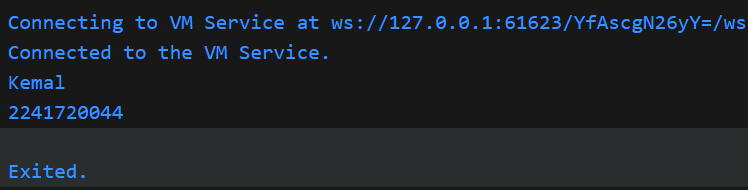
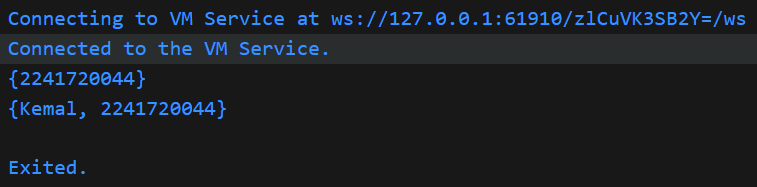
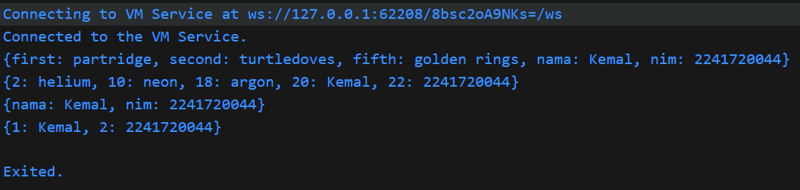

Nama    : M. Kemal Nugraha
Kelas   : 3D
NIM     : 2241720044

# Praktikum 1
1. Ketik atau salin kode program berikut ke dalam void main().
    ```dart
    var list = [1, 2, 3];
    assert(list.length == 3);
    assert(list[1] == 2);
    print(list.length);
    print(list[1]);

    list[1] = 1;
    assert(list[1] == 1);
    print(list[1]);
    ```
2. Silakan coba eksekusi (Run) kode pada langkah 1 tersebut. Apa yang terjadi? Jelaskan!\
**Jawab:**
    ```
    3
    2
    1
    ```
    yang terjadi adalah nilai didalam list dicek menggunakan fungsi assert dan melakukan print length, nilai dan merubah nilai. Fungsi assert berguna sama seperti if, yaitu untuk menerapkan logical operation. 

3. Ubah kode pada langkah 1 menjadi variabel final yang mempunyai index = 5 dengan default value = `null`. Isilah nama dan NIM Anda pada elemen index ke-1 dan ke-2. Lalu print dan capture hasilnya.\
Apa yang terjadi ? Jika terjadi error, silakan perbaiki.\
**Jawab:**
    ```dart
    var index = <dynamic>[null, null, null, null, null];
    index[1] = 'Kemal';
    index[2] = 2241720044;
    assert(index[1] == 'Kemal');
    print(index[1]);
    assert(index[2] == 2241720044);
    print(index[2]);
    ```
    **hasil:**
    
    Tanpa adanya tipe list dynamic, secara default dart akan memberikan tipe Null pada list karena seluruh isi variabelnya adalah null. Apabila tipe list Null, tidak bisa dimasukkan dengan nilai bertipe lainnya (contohnya nilai 'Kemal' yang betipe String). Tipe list dynamic berfungsi agar list bisa dimasukkan nilai bertipe lainnya.

# Praktikum 2
1. Ketik atau salin kode program berikut ke dalam fungsi main().
    ```dart
    var halogens = {'fluorine', 'chlorine', 'bromine', 'iodine', 'astatine'};
    print(halogens);
    ```
2. Silakan coba eksekusi (Run) kode pada langkah 1 tersebut. Apa yang terjadi? Jelaskan!\
**Jawab:**
    ```
    {fluorine, chlorine, bromine, iodine, astatine}
    ```
    Yang terjadi adalah akan dicetak seluruh nilai dalam set.

3. Tambahkan kode program berikut, lalu coba eksekusi (Run) kode Anda.
    ```dart
    var names1 = <String>{};
    Set<String> names2 = {}; // This works, too.
    var names3 = {}; // Creates a map, not a set.

    print(names1);
    print(names2);
    print(names3);
    ```
    Apa yang terjadi ? Jika terjadi error, silakan perbaiki namun tetap menggunakan ketiga variabel tersebut. Tambahkan elemen nama dan NIM Anda pada kedua variabel Set tersebut dengan dua fungsi berbeda yaitu .add() dan .addAll(). Untuk variabel Map dihapus, nanti kita coba di praktikum selanjutnya.

    Dokumentasikan code dan hasil di console, lalu buat laporannya.\
    **Jawab:**\
    Yang terjadi adalah hanya menampilkan map/set yang kosong.
    ```
    {}
    {}
    {}
    ```

    **Perbaikan:**
    ```dart
    var names1 = <String>{"2241720044"};
    Set<String> names2 = {};

    names2.add("Kemal");
    names2.addAll(names1);
    print(names1);
    print(names2);
    ```
    **hasil:**
    
    Setelah dilakukan perubahan, yang sebelumnya nilai Set names2 adalah kosong akan ditambahkan nilai baru dengan fungsi .add. Nilai dari Set names1 akan ditambahkan pada names2 dengan menggunakan .addAll yang menghasilkan Set names2 memiliki 2 nilai.
# Praktikum 3
1. Ketik atau salin kode program berikut ke dalam fungsi main().
    ```dart
    var gifts = {
    // Key:    Value
    'first': 'partridge',
    'second': 'turtledoves',
    'fifth': 1
    };

    var nobleGases = {
    2: 'helium',
    10: 'neon',
    18: 2,
    };

    print(gifts);
    print(nobleGases);
    ```
2. Silakan coba eksekusi (Run) kode pada langkah 1 tersebut. Apa yang terjadi? Jelaskan!\
**Jawab:**
    ```
    {first: partridge, second: turtledoves, fifth: 1}
    {2: helium, 10: neon, 18: 2}
    ```
    Untuk membuat Map simpelnya hanya dengan 
    ```
    <tipe_data> nama_map = {value atau key:value}
    ```
    tetapi tipe data Map adalah dynamic secara default. 

    dalam Map kita juga bisa menambahkan key dan valuenya agar lebih mudah dalam pemanggilan nilainya. Apabila dilakukan print, maka yang muncul adalah key dan value dari dalam Map itu sendiri.
3. Tambahkan kode program berikut, lalu coba eksekusi (Run) kode Anda.
    ```dart
    var mhs1 = Map<String, String>();
    gifts['first'] = 'partridge';
    gifts['second'] = 'turtledoves';
    gifts['fifth'] = 'golden rings';

    var mhs2 = Map<int, String>();
    nobleGases[2] = 'helium';
    nobleGases[10] = 'neon';
    nobleGases[18] = 'argon';
    ```
    Apa yang terjadi ? Jika terjadi error, silakan perbaiki.

    Tambahkan elemen nama dan NIM Anda pada tiap variabel di atas (gifts, nobleGases, mhs1, dan mhs2). Dokumentasikan hasilnya dan buat laporannya!

    **Jawab:**\
    Yang terjadi adalah nilai dalam map gifts dan nobleGases akan diganti menjadi,
    ```
    {first: partridge, second: turtledoves, fifth: golden rings}
    {2: helium, 10: neon, 18: argon}
    ```
    Tidak ada error yang terjadi, hanya saja Map mhs1 dan mhs2 tidak terpakai.

    **Perbaikan:**
    ```dart
    var gifts = {
        // Key:    Value
        'first': 'partridge',
        'second': 'turtledoves',
        'fifth': 1
    };

    var nobleGases = {
        2: 'helium',
        10: 'neon',
        18: 2,
    };

    var mhs1 = Map<String, String>();
    gifts['first'] = 'partridge';
    gifts['second'] = 'turtledoves';
    gifts['fifth'] = 'golden rings';
    gifts['nama'] = 'Kemal';
    gifts['nim'] = '2241720044';

    var mhs2 = Map<int, String>();
    nobleGases[2] = 'helium';
    nobleGases[10] = 'neon';
    nobleGases[18] = 'argon';
    nobleGases[20] = 'Kemal';
    nobleGases[22] = '2241720044';

    mhs1['nama'] = 'Kemal';
    mhs1['nim'] = '2241720044';

    mhs2[1] = 'Kemal';
    mhs2[2] = '2241720044';

    print(gifts);
    print(nobleGases);
    print(mhs1);
    print(mhs2);
    ```
    
    dalam penambahan isi dari map, harus diikuti format/ tipe data key-value dari mapnya sendiri. Contohnya pada Map mhs1 key-nya menggunakan tipe data String dan value-nya juga String seperti berikut,
    ```
    mhs1['nama'] = 'Kemal';
    ```
    'nama' akan menjadi key dan 'kemal' akan menjadi value. 

# Praktikum 4
1. Ketik atau salin kode program berikut ke dalam fungsi main().
    ```dart
    var list = [1, 2, 3];
    var list2 = [0, ...list];
    print(list1);
    print(list2);
    print(list2.length);
    ```

2. Silakan coba eksekusi (Run) kode pada langkah 1 tersebut. Apa yang terjadi? Jelaskan!\
**Error:**\
Terdapat error pada ` print(list1);` karena variabel tersebut belum terdeklarasi. Solusi: diubah menjadi nama 'list'\
**Jawab:**
    ```
    [1, 2, 3]
    [0, 1, 2, 3]
    4
    ```
    '...' adalah spread operator yang berfungsi untuk menambakan seluruh nilai dari list tertentu. Cara kerjanya juga mirip seperti fungsi .addAll. 
    
    Seperti pada contoh, yang awalnya list2 hanya memiliki nilai 0 saja, lalu ditambahkan nilai dari list menggunakan spread operator, maka hasilnya nilai list 2 terdapat tambahan dari list. 

3. Tambahkan kode program berikut, lalu coba eksekusi (Run) kode Anda.
    ```dart
    list1 = [1, 2, null];
    print(list1);
    var list3 = [0, ...?list1];
    print(list3.length);
    ```
    Apa yang terjadi ? Jika terjadi error, silakan perbaiki.\
    **Jawab:**\
    ```
    [1, 2, 3]
    [0, 1, 2, 3]
    4
    [1, 2, null]
    4
    ```
    Error yang terjadi hanyalah belum diberinya tipe data pada list1. Perbaikan yang dilakukan hanya dengan memberi tipe data semisal var.

    Tambahkan variabel list berisi NIM Anda menggunakan Spread Operators. Dokumentasikan hasilnya dan buat laporannya!\
    **Jawab:**
    ```dart
    var list = [1, 2, 3];
    var list2 = [0, ...list];
    print(list);
    print(list2);
    print(list2.length);

    var list1 = [1, 2, 2241720044];
    print(list1);
    var list3 = [0, ...?list1];
    print(list3.length);
    ```
    **hasil**
    ```
    [1, 2, 3]
    [0, 1, 2, 3]
    4
    [1, 2, 2241720044]
    4
    ```

4. Tambahkan kode program berikut, lalu coba eksekusi (Run) kode Anda.
    ```dart
    var nav = ['Home', 'Furniture', 'Plants', if (promoActive) 'Outlet'];
    print(nav);
    ```
    Apa yang terjadi ? Jika terjadi error, silakan perbaiki. Tunjukkan hasilnya jika variabel promoActive ketika true dan false.\
    **Jawab:**
    Error terjadi karena variabel promoActive belum dilakukan deklarasi maupun inisialisasi.

    **Perbaikan:**
    ```dart
    // saat true
    bool promoActive = true;
    var nav = ['Home', 'Furniture', 'Plants', if (promoActive) 'Outlet'];
    print(nav);
    ```
    hasil : `[Home, Furniture, Plants, Outlet]`
    ```dart
    // saat false
    bool promoActive = false;
    var nav = ['Home', 'Furniture', 'Plants', if (promoActive) 'Outlet'];
    print(nav);
    ```
    hasil : `[Home, Furniture, Plants]`

5. Tambahkan kode program berikut, lalu coba eksekusi (Run) kode Anda.
    ```dart
    var nav2 = ['Home', 'Furniture', 'Plants', if (login case 'Manager') 'Inventory'];
    print(nav2);
    ```
    Apa yang terjadi ? Jika terjadi error, silakan perbaiki. Tunjukkan hasilnya jika variabel login mempunyai kondisi lain.\
    **Jawab:**\
    Error terjadi karena variabel login belum dilakukan deklarasi maupun inisialisasi.

    **Perbaikan:**
    ```dart
    var login = 'Admin';
    var nav2 = [
        'Home',
        'Furniture',
        'Plants',
        if (login case 'Manager') 'Inventory'
    ];
    print(nav2);
    ```
    hasil : `[Home, Furniture, Plants]`
6. Tambahkan kode program berikut, lalu coba eksekusi (Run) kode Anda.
    ```dart
    var listOfInts = [1, 2, 3];
    var listOfStrings = ['#0', for (var i in listOfInts) '#$i'];
    assert(listOfStrings[1] == '#1');
    print(listOfStrings);
    ```
    Apa yang terjadi ? Jika terjadi error, silakan perbaiki. Jelaskan manfaat Collection For dan dokumentasikan hasilnya.\
    hasil : `[#0, #1, #2, #3]`

    **Jawab:**\
    Fungsi dari Collection for adalah untuk memudahkan memasukkan nilai dalam collection. Semisal akan memasukkan data dari database menjadi bentuk Collection, for bisa menjadi solusinya dengan tinggal melakukan loop berdasarkan id data dan memasukkan nilai dari kolom yag diinginkan untuk menjadi Collection. 

# Praktikum 5
1. Ketik atau salin kode program berikut ke dalam fungsi main().
    ```dart
    var record = ('first', a: 2, b: true, 'last');
    print(record)
    ```
2. Silakan coba eksekusi (Run) kode pada langkah 1 tersebut. Apa yang terjadi? Jelaskan!\
**Jawab:**

3. Tambahkan kode program berikut di luar scope void main(), lalu coba eksekusi (Run) kode Anda.
    ```dart
    (int, int) tukar((int, int) record) {
    var (a, b) = record;
    return (b, a);
    }
    ```
    Apa yang terjadi ? Jika terjadi error, silakan perbaiki. Gunakan fungsi tukar() di dalam main() sehingga tampak jelas proses pertukaran value field di dalam Records.\
    **Jawab:**

    **Perbaikan:**

4. Tambahkan kode program berikut di dalam scope void main(), lalu coba eksekusi (Run) kode Anda.
    ```dart
    // Record type annotation in a variable declaration:
    (String, int) mahasiswa;
    print(mahasiswa);
    ```
    Apa yang terjadi ? Jika terjadi error, silakan perbaiki. Inisialisasi field nama dan NIM Anda pada variabel record mahasiswa di atas. Dokumentasikan hasilnya dan buat laporannya!\
    **Jawab:**

    **Perbaikan:**

5. Tambahkan kode program berikut di dalam scope void main(), lalu coba eksekusi (Run) kode Anda.
    ```dart
    var mahasiswa2 = ('first', a: 2, b: true, 'last');

    print(mahasiswa2.$1); // Prints 'first'
    print(mahasiswa2.a); // Prints 2
    print(mahasiswa2.b); // Prints true
    print(mahasiswa2.$2); // Prints 'last'
    ```
    Apa yang terjadi ? Jika terjadi error, silakan perbaiki. Gantilah salah satu isi record dengan nama dan NIM Anda, lalu dokumentasikan hasilnya dan buat laporannya!\
    **Jawab:**

    **Perbaikan:**


# Tugas Praktikum
1. Silakan selesaikan Praktikum 1 sampai 5, lalu dokumentasikan berupa screenshot hasil pekerjaan Anda beserta penjelasannya!
2. Jelaskan yang dimaksud Functions dalam bahasa Dart!
**Jawab:**


3. Jelaskan jenis-jenis parameter di Functions beserta contoh sintaksnya!
**Jawab:**


4. Jelaskan maksud Functions sebagai first-class objects beserta contoh sintaknya!
**Jawab:**


5. Apa itu Anonymous Functions? Jelaskan dan berikan contohnya!
**Jawab:**


6. Jelaskan perbedaan Lexical scope dan Lexical closures! Berikan contohnya!
**Jawab:**


7. Jelaskan dengan contoh cara membuat return multiple value di Functions!
**Jawab:**


8. Kumpulkan berupa link commit repo GitHub pada tautan yang telah disediakan di grup Telegram!


