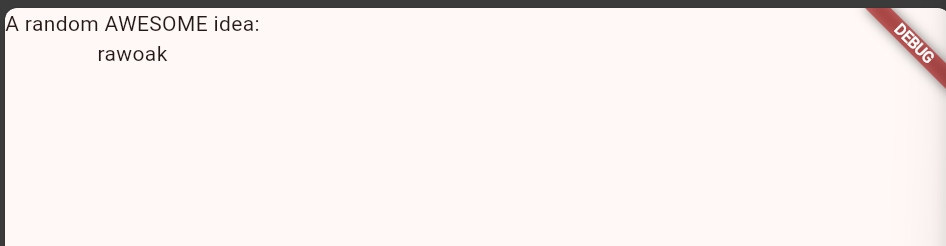

Nama    : M. Kemal Nugraha

Kelas   : 3D

NIM     : 2241720044

# Praktikum 1

Aplikasi demo dari flutter berhasil dibuat.

# Praktikum 2

Setelah project dipush, inilah project default dari flutter.

# Praktikum 3
1. Text widget

Ditampilkan text widget dari function yang sudah dibuat.

2. Image widget


# Praktikum 4
1. Scaffold Widget


2. Dialog Widget


3. Input dan Selection Widget


4. Date and Time Pickers


# Tugas Praktikum
1. Setup Environment Flutter
device saya sudah dilengkapi dengan VScode dan telah menginstall flutter SDK.

2. Membuat project
Build project:


create pubspec.yaml
```yaml
name: flutter_google
description: A new Flutter project.

publish_to: 'none' # Remove this line if you wish to publish to pub.dev

version: 0.0.1+1

environment:
  sdk: '>=2.19.4 <4.0.0'

dependencies:
  flutter:
    sdk: flutter

  english_words: ^4.0.0
  provider: ^6.0.0

dev_dependencies:
  flutter_test:
    sdk: flutter

  flutter_lints: ^2.0.0

flutter:
  uses-material-design: true
```

analysis_options.yaml
```yaml
include: package:flutter_lints/flutter.yaml

linter:
  rules:
    prefer_const_constructors: false
    prefer_final_fields: false
    use_key_in_widget_constructors: false
    prefer_const_literals_to_create_immutables: false
    prefer_const_constructors_in_immutables: false
    avoid_print: false
```

perubahan main.dart
```dart
import 'package:english_words/english_words.dart';
import 'package:flutter/material.dart';
import 'package:provider/provider.dart';

void main() {
  runApp(MyApp());
}

class MyApp extends StatelessWidget {
  const MyApp({super.key});

  @override
  Widget build(BuildContext context) {
    return ChangeNotifierProvider(
      create: (context) => MyAppState(),
      child: MaterialApp(
        title: 'Namer App',
        theme: ThemeData(
          useMaterial3: true,
          colorScheme: ColorScheme.fromSeed(seedColor: Colors.deepOrange),
        ),
        home: MyHomePage(),
      ),
    );
  }
}

class MyAppState extends ChangeNotifier {
  var current = WordPair.random();
}

class MyHomePage extends StatelessWidget {
  @override
  Widget build(BuildContext context) {
    var appState = context.watch<MyAppState>();

    return Scaffold(
      body: Column(
        children: [
          Text('A random idea:'),
          Text(appState.current.asLowerCase),
        ],
      ),
    );
  }
}
```

3. Menambahkan tombol
Hot Reload\
Sebelum hot reload


Setelah dilakukan hot reload


Menambahkan tombol\


First Action\


4. Memperindah tampilan
Mengekstark widget
```dart
class MyHomePage extends StatelessWidget {
  @override
  Widget build(BuildContext context) {
    var appState = context.watch<MyAppState>();
    var pair = appState.current;

    return Scaffold(
      body: Column(
        children: [
          Text('A random AWESOME idea:'), // ← Example change.
          BigCard(pair: pair), // <-- ekstrak widget

          ElevatedButton(
            onPressed: () {
              appState.getNext();
            },
            child: Text('Next'),
          ),
        ],
      ),
    );
  }
}

class BigCard extends StatelessWidget { // <-- hasil  ekstrak widget
  const BigCard({
    super.key,
    required this.pair,
  });

  final WordPair pair;

  @override
  Widget build(BuildContext context) {
    return Text(pair.asLowerCase);
  }
}
```

Menambahkan kartu


Tema dan gaya


Text theme


Meningkatkan aksesibilitas
Saat text ditekan, akan muncul suara dan membacakan teks tersebut.

Menempatkan UI di tengah


5. Menambahkan fungsi
Menambahkan logika bisnis
Belum ada tombol untuk menambahkan like.

Menambahkan tombol like


6. Menambahkan kolom navigasi


Widget stateless versus stateful
```dart
class MyHomePage extends StatefulWidget {
  @override
  State<MyHomePage> createState() => _MyHomePageState();
}

class _MyHomePageState extends State<MyHomePage> {
// ...
```
Secara sistem, penggantian ke statefulWidget tidak akan merubah tampilan. Perubahan tampilan akan terjadi apabila logika nya tersedia dan menggunakan variable setState untuk memancing perubahan pada statefulWidget.

setState


Menggunakan selectedIndex


Tingkat respons


7. Menambahkan halaman baru


