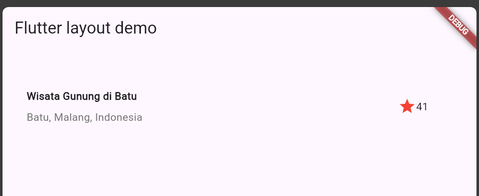

Nama    : M. Kemal Nugraha

Kelas   : 3D

NIM     : 2241720044

# Praktikum 1
hasil akhir:


**soal 1**\
Letakkan widget Column di dalam widget Expanded agar menyesuaikan ruang yang tersisa di dalam widget Row. Tambahkan properti crossAxisAlignment ke CrossAxisAlignment.start sehingga posisi kolom berada di awal baris.\
jawab:

```dart
...
 @override
  Widget build(BuildContext context) {
    Widget titleSection = Container(
      // memberi padding semua sisi 32
      padding: const EdgeInsets.all(32),
      child: Row(
        children: [
          Expanded(
            /* soal 1*/
            child: Column(
              crossAxisAlignment: CrossAxisAlignment.start,
              children: [
...
```

**soal 2**\
Letakkan baris pertama teks di dalam Container sehingga memungkinkan Anda untuk menambahkan padding = 8. Teks ‘Batu, Malang, Indonesia' di dalam Column, set warna menjadi abu-abu.\
Jawab:

```dart
...
children: [
    /* soal 2*/
    Container(
        // memberi padding bottom 8
        padding: const EdgeInsets.only(bottom: 8),
        child: const Text(
        'Wisata Gunung di Batu',
        style: TextStyle(
            fontWeight: FontWeight.bold,
        ),
        ),
    ),
    Text(
        'Batu, Malang, Indonesia',
        // warna teks menjadi abu-abu
        style: TextStyle(color: Colors.grey[600]),
    ),
],
...
```

**soal 3** \
Dua item terakhir di baris judul adalah ikon bintang, set dengan warna merah, dan teks "41". Seluruh baris ada di dalam Container dan beri padding di sepanjang setiap tepinya sebesar 32 piksel. Kemudian ganti isi body text ‘Hello World' dengan variabel titleSection seperti contoh\
Jawab:

```dart
...
Container(
    // memberi padding semua sisi 32
    padding: const EdgeInsets.all(32),
    child: Row(
        children: [
        Icon(
            Icons.star,
            // mengubah warna bintang menjadi merah
            color: Colors.red[500],
        ),
        // const SizedBox(width: 8),
        const Text('41'),
        ],
    ),
),
...

...
return MaterialApp(
    title: 'Flutter layout: Muhammad Kemal Nugraha dan 2241720044',
    home: Scaffold(
        appBar: AppBar(
            title: const Text('Flutter layout demo'),
        ),
        body: Column(
        children: [
            titleSection,
        ],
    ),
...
```

# Praktikum 2