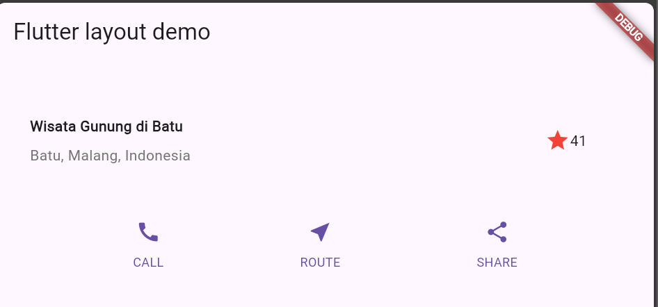
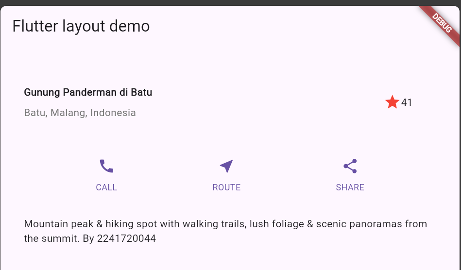
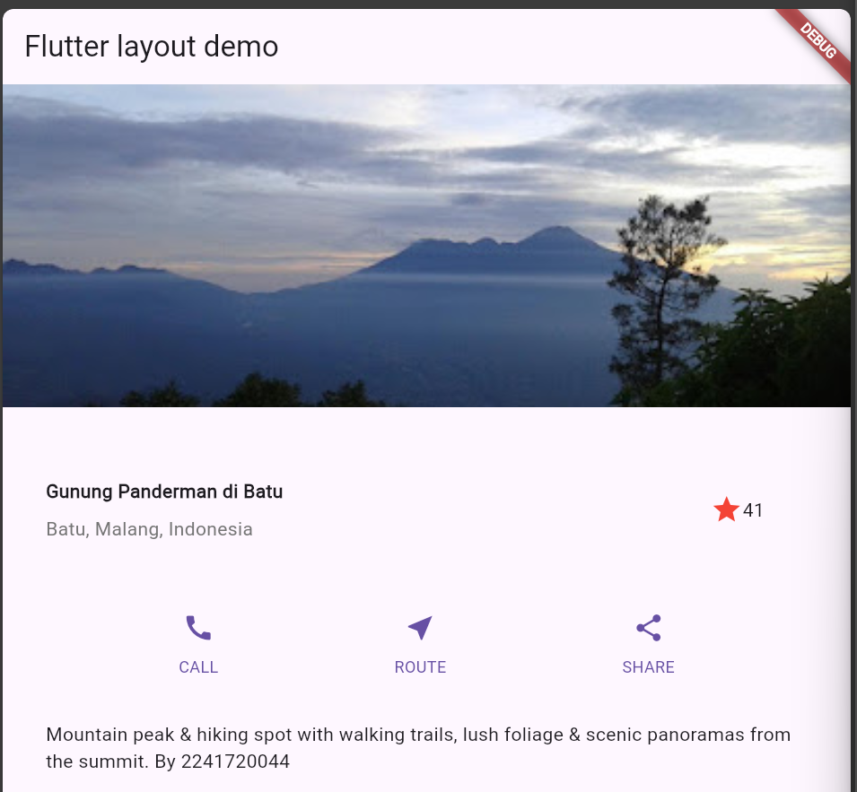
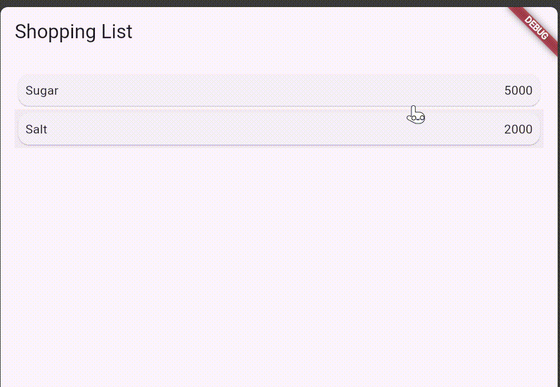
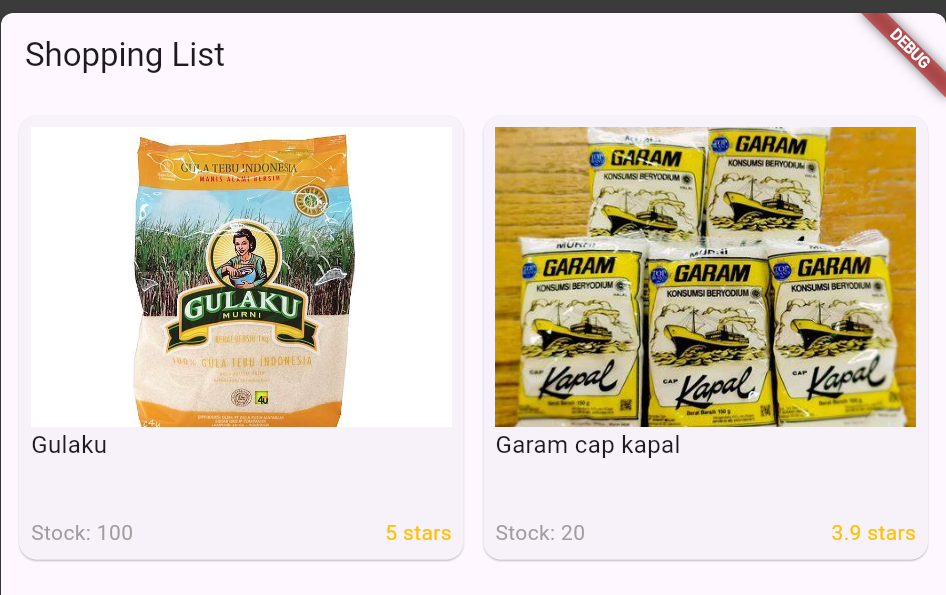

Nama    : M. Kemal Nugraha

Kelas   : 3D

NIM     : 2241720044

# Praktikum 1
hasil akhir:


**soal 1**\
Letakkan widget Column di dalam widget Expanded agar menyesuaikan ruang yang tersisa di dalam widget Row. Tambahkan properti crossAxisAlignment ke CrossAxisAlignment.start sehingga posisi kolom berada di awal baris.\
jawab:

```dart
...
 @override
  Widget build(BuildContext context) {
    Widget titleSection = Container(
      // memberi padding semua sisi 32
      padding: const EdgeInsets.all(32),
      child: Row(
        children: [
          Expanded(
            /* soal 1*/
            child: Column(
              crossAxisAlignment: CrossAxisAlignment.start,
              children: [
...
```

**soal 2**\
Letakkan baris pertama teks di dalam Container sehingga memungkinkan Anda untuk menambahkan padding = 8. Teks ‘Batu, Malang, Indonesia' di dalam Column, set warna menjadi abu-abu.\
Jawab:

```dart
...
children: [
    /* soal 2*/
    Container(
        // memberi padding bottom 8
        padding: const EdgeInsets.only(bottom: 8),
        child: const Text(
        'Wisata Gunung di Batu',
        style: TextStyle(
            fontWeight: FontWeight.bold,
        ),
        ),
    ),
    Text(
        'Batu, Malang, Indonesia',
        // warna teks menjadi abu-abu
        style: TextStyle(color: Colors.grey[600]),
    ),
],
...
```

**soal 3** \
Dua item terakhir di baris judul adalah ikon bintang, set dengan warna merah, dan teks "41". Seluruh baris ada di dalam Container dan beri padding di sepanjang setiap tepinya sebesar 32 piksel. Kemudian ganti isi body text ‘Hello World' dengan variabel titleSection seperti contoh\
Jawab:

```dart
...
Container(
    // memberi padding semua sisi 32
    padding: const EdgeInsets.all(32),
    child: Row(
        children: [
        Icon(
            Icons.star,
            // mengubah warna bintang menjadi merah
            color: Colors.red[500],
        ),
        // const SizedBox(width: 8),
        const Text('41'),
        ],
    ),
),
...

...
return MaterialApp(
    title: 'Flutter layout: Muhammad Kemal Nugraha dan 2241720044',
    home: Scaffold(
        appBar: AppBar(
            title: const Text('Flutter layout demo'),
        ),
        body: Column(
        children: [
            titleSection,
        ],
    ),
...
```

# Praktikum 2
hasil akhir:


# Praktikum 3
hasil akhir:


# Praktikum 4
hasil akhir:


# Praktikum 5
hasil akhir:


# Tugas Praktikum 2
1. Untuk melakukan pengiriman data ke halaman berikutnya, cukup menambahkan informasi arguments pada penggunaan `Navigator`. Perbarui kode pada bagian `Navigator` menjadi seperti berikut.

2. Pembacaan nilai yang dikirimkan pada halaman sebelumnya dapat dilakukan menggunakan ModalRoute. Tambahkan kode berikut pada blok fungsi build dalam halaman ItemPage. Setelah nilai didapatkan, anda dapat menggunakannya seperti penggunaan variabel pada umumnya.

3. Pada hasil akhir dari aplikasi belanja yang telah anda selesaikan, tambahkan atribut foto produk, stok, dan rating. Ubahlah tampilan menjadi GridView seperti di aplikasi marketplace pada umumnya.

Dibawah ini adalah hasil dari step 1, 2, dan 3 Tugas Praktikum 2

**Kode**\
perubahan pada class item
```dart
class Item {
  String name;
  int price;
  int stock;
  double rating;
  String photo;

  Item(
      {required this.name,
      required this.price,
      required this.stock,
      required this.rating,
      required this.photo});
}
```

Penerapan Grid View
```dart
body: Container(
    margin: EdgeInsets.all(8),
    child: GridView.builder(
        gridDelegate: const SliverGridDelegateWithFixedCrossAxisCount(
        crossAxisCount: 2,
        mainAxisSpacing: 5.0,
        crossAxisSpacing: 5.0,
        ),
        itemCount: items.length,
        itemBuilder: (BuildContext context, int index) {
        final item = items[index];
        return InkWell(
            onTap: () {
            Navigator.pushNamed(context, '/item', arguments: item);
            },
            child: Card(
            child: Container(
                margin: EdgeInsets.all(8),
                child: Column(
                crossAxisAlignment: CrossAxisAlignment.start,
                children: [
                    // Display photo (assuming assets)
                    if (item.photo != null)
                    Image.asset(
                        item.photo!,
                        height: 200.0,
                        width: double.infinity,
                        fit: BoxFit.cover,
                    ),
                    Expanded(
                    child: Text(
                        item.name,
                        style: TextStyle(fontSize: 16.0),
                    ),
                    ),
                    Row(
                    mainAxisAlignment: MainAxisAlignment.spaceBetween,
                    children: [
                        Text(
                        'Stock: ${item.stock}',
                        style: TextStyle(color: Colors.grey),
                        ),
                        Text(
                        '${item.rating} stars',
                        style: TextStyle(color: Colors.amber),
                        ),
                    ],
                    ),
                ],
                ),
            ),
            ),
        );
        },
    ),
),
```

**Hasil akhir:**


4. Silakan implementasikan Hero widget pada aplikasi belanja Anda dengan mempelajari dari sumber ini: `https://docs.flutter.dev/cookbook/navigation/hero-animations`

5. Sesuaikan dan modifikasi tampilan sehingga menjadi aplikasi yang menarik. Selain itu, pecah widget menjadi kode yang lebih kecil. Tambahkan Nama dan NIM di footer aplikasi belanja Anda.

Dibawah ini adalah jawaban untuk Nomor 4 dan 5

**Kode:**


**Hasil akhir:**
